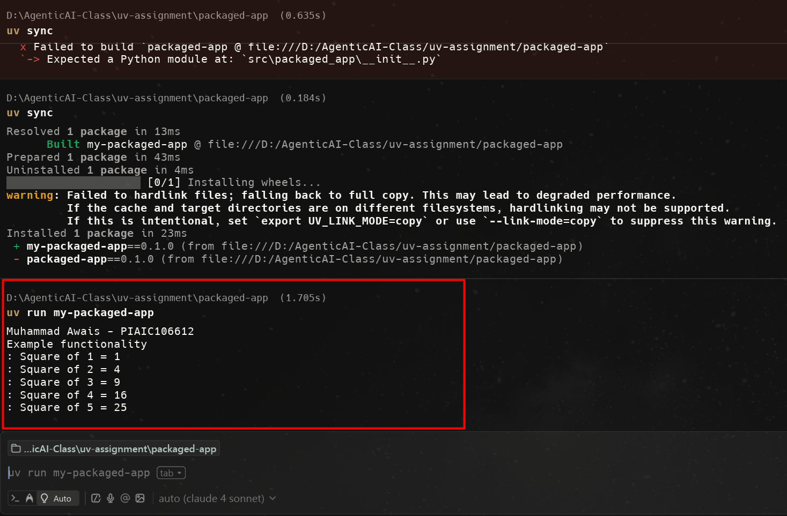

# Packaged App

This is a **Packaged Application** built with [uv](https://github.com/astral-sh/uv).  
It demonstrates how to structure and run a Python package using uv.

---

## 📌 Functionality
- Prints my **Name** and **PIAIC Registration Number**.
- Shows an **example functionality** by printing the squares of numbers from 1 to 5.

---

## ▶️ How to Run
Inside the `packaged-app` folder:

```bash
uv run my-packaged-app

## 🖼️ Output Screenshot
