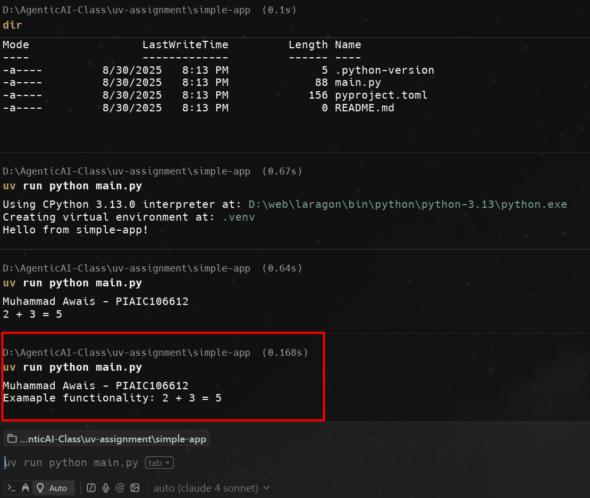

# Simple App

This is a **Simple Application** built with [uv](https://github.com/astral-sh/uv).  
It demonstrates a minimal Python script managed with uv.

---

## 📌 Functionality
- Prints my **Name** and **PIAIC Registration Number**.
- Performs a simple calculation.

---

## ▶️ How to Run
Inside the `simple-app` folder:

```bash
uv run python main.py

## 🖼️ Output Screenshot
